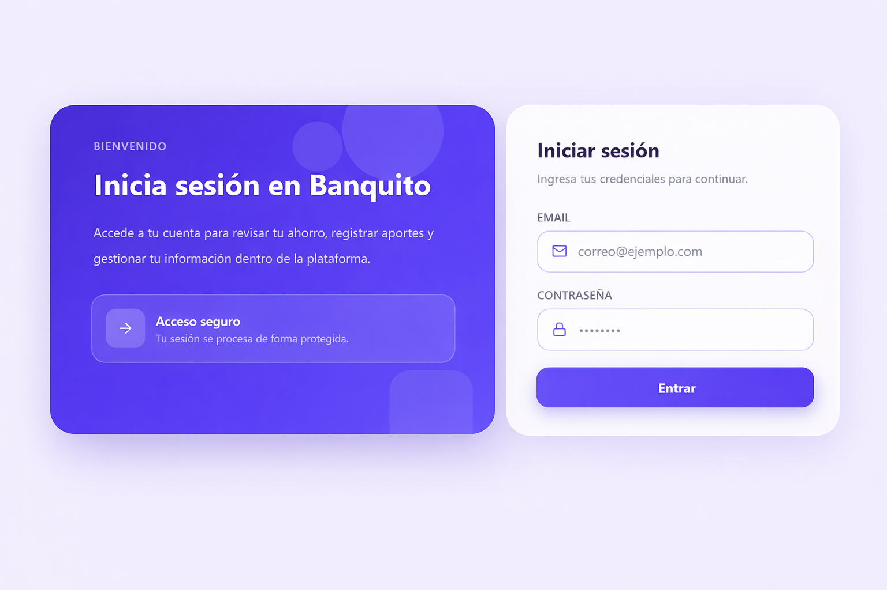
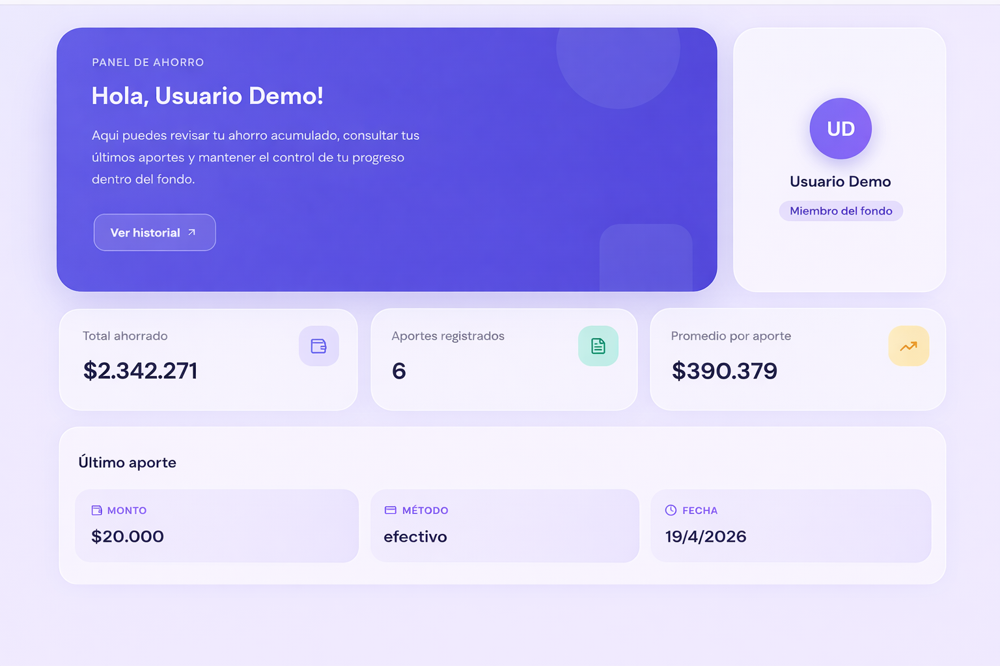
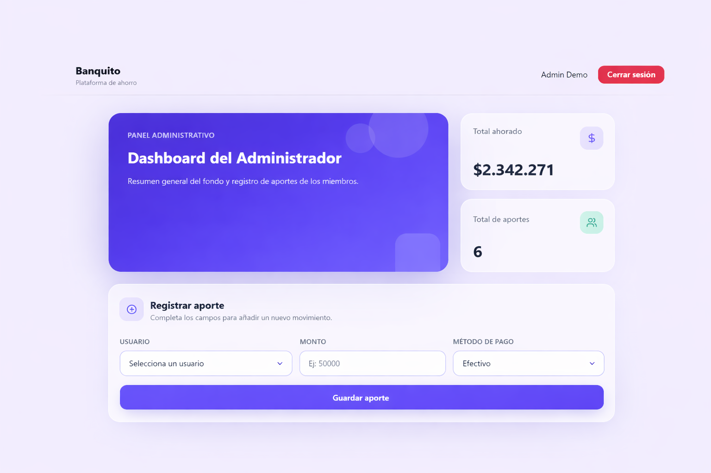
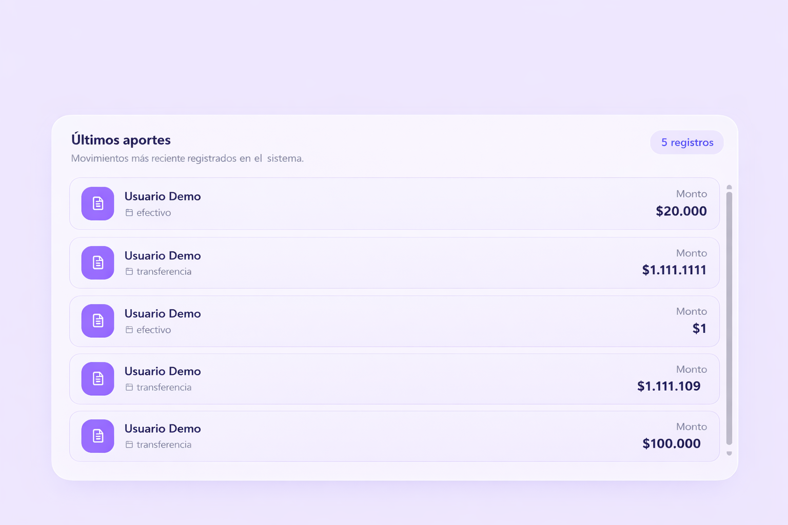
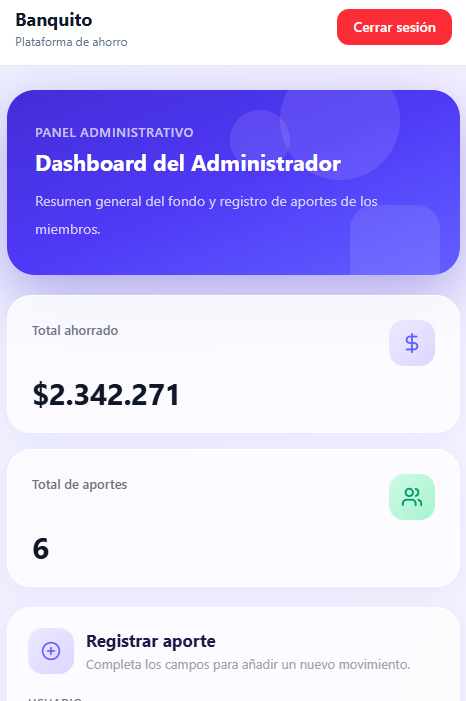
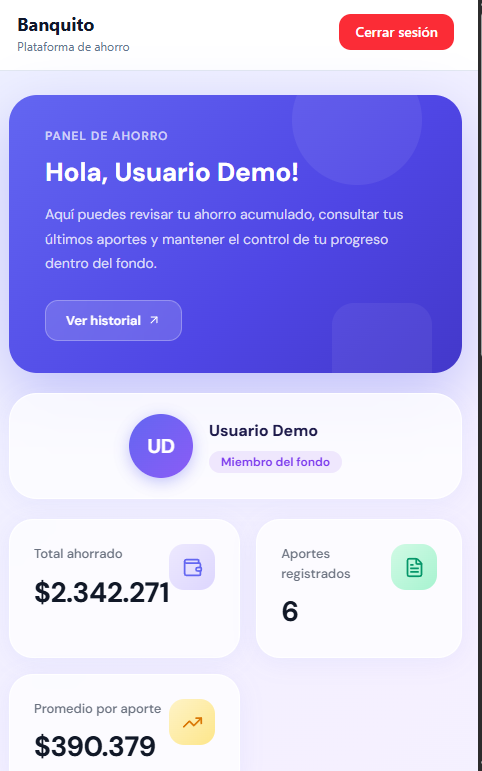

# 💰 Banquito App

  Plataforma web fullstack para la gestión de ahorro grupal, con control administrativo y visualización clara para usuarios.

---

## 📸 Preview

  

  <em>Pantalla de inicio de sesión</em>

---

  

  <em>Dashboard del usuario con resumen de ahorro</em>

---

  

  <em>Panel administrativo con control del fondo</em>

---

  

  <em>Registro de aportes por el administrador</em>

---

  

  <em>Vista responsive (Administrador)</em>

---

  

  <em>Vista responsive (Usuario)</em>

---

## 💡 Descripción del Proyecto

**"Mi Banquito"** es una aplicación diseñada para gestionar fondos compartidos de manera clara, estructurada y transparente.

Nace de una necesidad común en entornos reales como:

- 👨‍👩‍👧‍👦 Familias  
- 👥 Grupos de amigos  
- 🏢 Equipos de trabajo  
- 🤝 Asociaciones  

donde se manejan fondos compartidos sin herramientas adecuadas.

---

## 🎯 Objetivos del proyecto

- Simular un sistema real de gestión financiera  
- Implementar arquitectura fullstack moderna  
- Aplicar autenticación con roles (admin / user)  
- Diseñar dashboards con enfoque UX/UI  
- Conectar frontend y backend mediante APIs reales  

---

## 🧩 Problema que resuelve

El control de dinero compartido suele hacerse mediante:

- hojas de cálculo  
- mensajes informales  
- registros manuales  

Esto genera:

- ❌ falta de claridad  
- ❌ errores en cálculos  
- ❌ poca transparencia  

👉 **Banquito centraliza toda la información en una sola plataforma.**

---

## ⚙️ Funcionamiento

### 👨‍💼 Administrador
- Registra aportes  
- Visualiza el total del fondo  
- Consulta últimos movimientos  
- Controla el sistema  

### 👤 Usuario
- Consulta su ahorro acumulado  
- Visualiza su historial  
- Revisa su último aporte  
- Interfaz simple y clara  

---

## 🏦 Casos de uso

- 💰 Fondos de ahorro grupales  
- 🎓 Colectas para eventos  
- 👨‍👩‍👧‍👦 Ahorros familiares  
- 🏢 Equipos de trabajo  
- 🤝 Comunidades  

---

## 🛠️ Tecnologías

### Frontend
- React (Vite)
- TailwindCSS
- Axios

### Backend
- Node.js
- Express
- Prisma ORM

### Base de datos
- PostgreSQL

---

## 🧠 Arquitectura
Frontend (React)
↓
API REST (Express)
↓
Prisma ORM
↓
PostgreSQL

---

## ⚙️ Instalación

### 1. Clonar el repositorio

git clone https://github.com/FranXTeheran/banquito-demo.git
cd banquito-demo

---

### ⚙️ Configurar Backend

cd backend
npm install
npm run dev

### ⚙️ Configurar Frontend

cd frontend
npm install
npm run dev

---

🔐 Variables de entorno

Crear archivo .env en backend:

DATABASE_URL=
PORT=3000
JWT_SECRET=
JWT_EXPIRES_IN=1d

✨ Funcionalidades
🔐 Autenticación con roles
📊 Dashboard de usuario
📊 Dashboard de administrador
➕ Registro de aportes
📋 Historial con scroll
📱 Diseño responsive
📈 Cálculo de totales y promedios

🚀 Estado del proyecto

✔️ Funcional
✔️ Estructurado
✔️ Listo para despliegue

🚧 Posibles mejoras
Gráficas de ahorro (charts)
Notificaciones en tiempo real
Edición de usuarios
Exportación de reportes
Deploy completo en producción

🤝 Contribución

Si deseas mejorar este proyecto:

Haz un fork
Crea una rama (feature/nueva-funcionalidad)
Haz commit de tus cambios
Abre un Pull Request

📣 Nota

Proyecto desarrollado como práctica de desarrollo fullstack, simulando un caso real con enfoque en funcionalidad, diseño y escalabilidad.